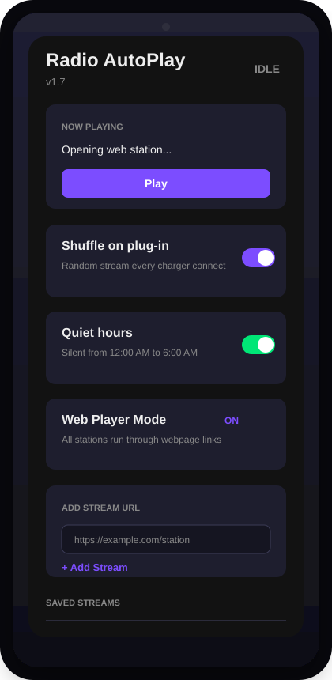
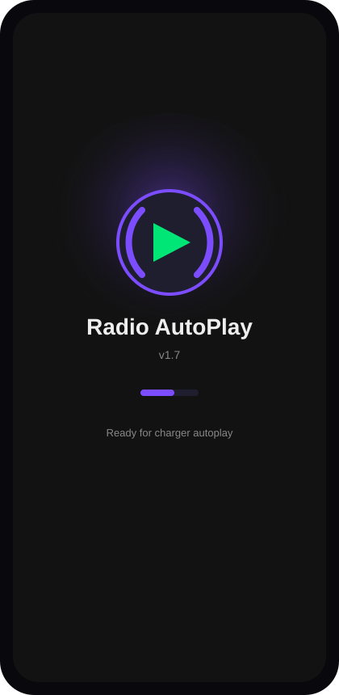

# Radio AutoPlay

An Android app for turning a spare phone into a charger-triggered radio player.

Plug the phone into power and Radio AutoPlay can wait through a 40-second startup window, play a random intro sound, preload one saved webpage radio station, and start its web player automatically. Unplug power and it stops cleanly.

It was built for a simple but fun setup: a spare Android phone, speakers, and a bathroom light switch or charger connection that makes the room come alive when power turns on.

[](https://github.com/akshay-knows/RadioAutoPlay/actions/workflows/build-apk.yml)
[](https://github.com/akshay-knows/RadioAutoPlay/actions/workflows/release-apk.yml)
[](https://github.com/akshay-knows/RadioAutoPlay/releases/latest)

## Preview

<p align="center">
  
  
</p>

## Highlights

| Feature | What it does |
|---|---|
| Charger autoplay | Starts playback when Android reports charger/power connected |
| Auto stop | Stops playback when charger/power is disconnected |
| 40-second startup window | Gives the phone/network time to settle and preload the webpage player |
| Random intro sounds | Plays one bundled or custom intro sound before the station |
| Webpage station mode | Opens one saved radio webpage in a hidden WebView, similar to a browser |
| OnlineRadioBox support | Finds the matching station player and starts it without overlapping other page audio |
| Volume normalizer | Keeps playback at a safer consistent level across loud and quiet stations |
| Quiet hours toggle | Optional silent window from 12:00 AM to 6:00 AM |
| Shuffle mode | Picks a random station every time the charger connects |
| Foreground service | Keeps playback alive with screen off and phone locked |
| Offline fallback audio | Plays bundled backup audio if the network disconnects |
| Diagnostics log | Writes playback events and failures to a local log file |
| In-app updater | Checks GitHub Releases, downloads the APK, and opens Android installer |
| Versioned APK archive | Release workflow saves APKs under `apk-releases/<version>/` |

## Latest Version

Current app version: **v1.17**

Download the latest APK from [GitHub Releases](https://github.com/akshay-knows/RadioAutoPlay/releases/latest).

The v1.17 APK is also archived here after the release workflow finishes:

```text
apk-releases/v1.17/RadioAutoPlay-v1.17.apk
```

## How It Works

```text
Charger connected
      |
      v
ChargerReceiver starts RadioService
      |
      v
40-second startup window
      |
      v
Random intro sound
      |
      v
Hidden WebView opens one station webpage
      |
      v
Intro finishes -> autoplay script starts that page player
      |
      v
Volume normalization keeps playback controlled
      |
      v
Charger disconnected -> playback stops
```

## Android Studio Setup

1. Install **JDK 17**.
2. Open this project folder in Android Studio.
3. Go to `File > Settings > Build, Execution, Deployment > Build Tools > Gradle`.
4. Set **Gradle JDK** to JDK 17.
5. Click **Sync Project with Gradle Files**.
6. Run the app on a phone or emulator.

Command-line build:

```bash
./gradlew assembleDebug
```

Debug APK output:

```text
app/build/outputs/apk/debug/app-debug.apk
```

## Recommended Phone Setup

For reliable always-on charger behavior:

- Open the app once after installing.
- Allow notifications.
- Disable battery optimization for **Radio AutoPlay**.
- Allow autostart/background activity if your phone brand has those settings.
- Keep Wi-Fi enabled if the phone is mounted in one place.
- Use the persistent notification to reopen the app if needed.

Android may block apps from visually opening their activity from the lock screen, so Radio AutoPlay is designed to run audio in the background.

## Managing Stations

The app stores stations in SharedPreferences. You can:

- Use the built-in webpage station pool.
- Add your own `https://...` webpage station links.
- Import many links from CSV.
- Delete stations from the list.
- Shuffle stations on every charger connection.

CSV example:

```csv
name,url
Today Hits,https://onlineradiobox.com/us/977todayshits/?cs=us.977todayshits&played=1
Comedy,https://onlineradiobox.com/us/977comedy/?cs=us.977comedy&played=1
NPR,https://onlineradiobox.com/us/?cs=us.npr&played=1
```

## In-App Updates

Radio AutoPlay checks the latest GitHub Release from inside the app.

When a newer APK is available, the app can:

- Show an update prompt.
- Download the APK through Android DownloadManager.
- Open Android's normal installer screen.

Android does not allow normal apps to silently update themselves, so the final install confirmation is still shown by the system.

## Publishing A New Release

1. Increase `versionCode` and `versionName` in `app/build.gradle`.
2. Update the in-app changelog in `app/src/main/res/values/strings.xml`.
3. Build and test locally:

```bash
./gradlew assembleDebug lintDebug
```

4. Commit and push `main`.
5. Push a matching tag:

```bash
git tag -a v1.17 -m "Radio AutoPlay v1.17"
git push origin main
git push origin v1.17
```

The `Release APK` workflow builds the signed APK, archives it in the repo, and creates a GitHub Release.

## Project Structure

```text
app/src/main/java/com/radioautoplay/
  ChargerReceiver.java        # Receives charger connect/disconnect events
  ChargerMonitorService.java  # Keeps charger monitoring alive in background
  RadioService.java           # Playback, WebView player, normalizer, logs
  StreamUrlManager.java       # Station storage and defaults
  IntroSoundManager.java      # Custom/random intro sound storage
  MainActivity.java           # Main UI and controls
  UpdateManager.java          # In-app update flow
  DiagnosticsLogger.java      # Persistent local log writer
  UrlAdapter.java             # RecyclerView station list
```

## Permissions

| Permission | Why |
|---|---|
| `INTERNET` | Load webpage stations and stream audio |
| `ACCESS_NETWORK_STATE` | Detect network loss/reconnect |
| `FOREGROUND_SERVICE` | Keep playback alive in background |
| `FOREGROUND_SERVICE_MEDIA_PLAYBACK` | Media playback foreground service on newer Android |
| `POST_NOTIFICATIONS` | Show playback/update notifications |
| `RECEIVE_BOOT_COMPLETED` | Restart charger monitor after reboot |
| `REQUEST_INSTALL_PACKAGES` | Open downloaded APK update installer |
| `WAKE_LOCK` | Keep CPU awake during playback |

## License

MIT
